# Resultados del Review 1
## Estructura de la Tabla

Antes de ejecutar las consultas, se creo la base de datos `campers`, la tabla `estudiantes` y se le insertaron 50 filas de datos.
```sql
CREATE DATABASE campus;
-- \c campus
CREATE TABLE estudiantes (
   id SERIAL,
   nombre VARCHAR(60),
   edad INT,
   genero CHAR(1),
   promedio FLOAT,
   altura NUMERIC(3,2),
   fecha_ingreso DATE,
   hora_ingreso  TIME,
   fecha_hora_registro TIMESTAMP,
   duración_tests INTERVAL,
   analisis_perfil TEXT,
   activo BOOLEAN
);
```
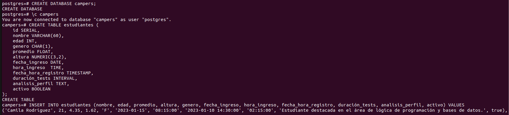
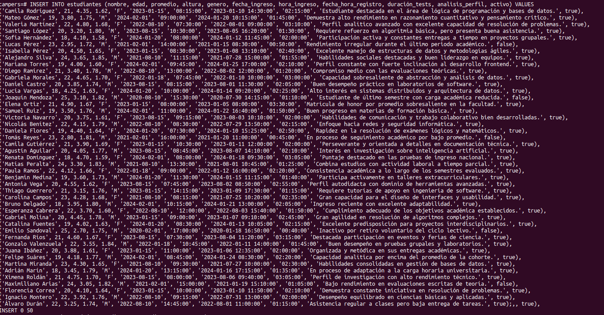

## SELECT

1. Obtener el nombre, edad y promedio de todos los estudiantes que se encuentren activos.
```sql
SELECT nombre, edad, promedio 
FROM estudiantes 
WHERE activo = TRUE;
```
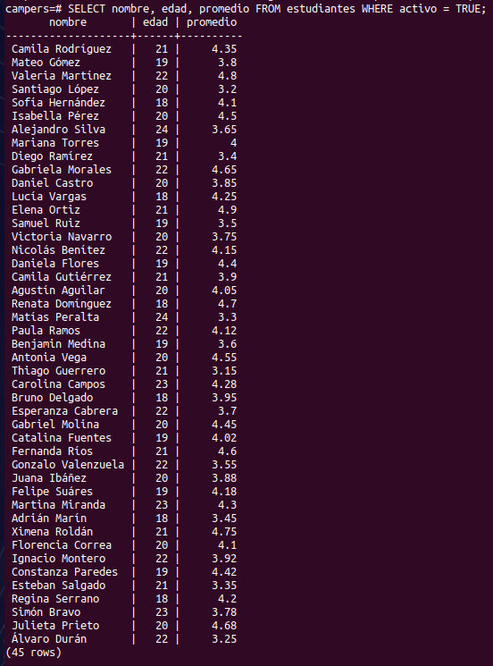

---

2. Listar todos los estudiantes del género femenino que tengan un promedio mayor o igual a 4.5.
```sql
SELECT * 
FROM estudiantes 
WHERE genero = 'F' AND promedio >= 4.5;
```


---

3. Consultar los estudiantes ingresados en el año 2024, ordenados de forma descendente por su fecha de ingreso.
```sql
SELECT * FROM estudiantes 
WHERE fecha_ingreso BETWEEN '2024-01-01' AND '2024-12-31' 
ORDER BY fecha_ingreso DESC;
```
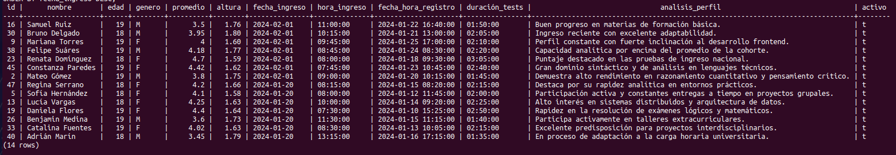

---

4. Obtener el promedio de edad y el promedio general de calificaciones de todos los estudiantes registrados.
```sql
SELECT 
    AVG(edad) AS promedio_edad, 
    AVG(promedio) AS promedio_calificaciones 
FROM estudiantes;
```


---

5. Contar cuántos estudiantes hay registrados por cada género.
```sql
SELECT genero, COUNT(*) AS total 
FROM estudiantes 
GROUP BY genero;
```
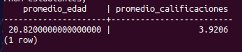

---

6. Listar los 5 estudiantes con los promedios más altos de toda la tabla.
```sql
SELECT nombre, promedio 
FROM estudiantes 
ORDER BY promedio DESC 
LIMIT 5;
```


---

7. Seleccionar los estudiantes cuya duración de tests haya sido mayor a 2 horas y media.
```sql
SELECT nombre, duración_tests 
FROM estudiantes 
WHERE duración_tests >= '02:30:00';
```
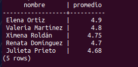

---

8. Buscar a los estudiantes cuyo análisis de perfil contenga la palabra "bases de datos" o "algoritmos".
```sql
SELECT nombre, analisis_perfil 
FROM estudiantes 
WHERE analisis_perfil LIKE '%bases de datos%' OR analisis_perfil LIKE '%algoritmos%';
```
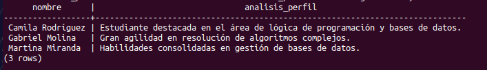

---

9. Calcular la altura máxima y mínima registrada entre los estudiantes hombres.
```sql
SELECT
    MIN(altura) AS altura_minima, 
    MAX(altura) AS altura_maxima 
FROM estudiantes 
WHERE genero = 'M';
```
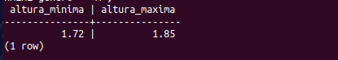

---

10. Mostrar el nombre, fecha y hora exacta de registro de los estudiantes que ingresaron antes de las 09:00:00 AM.
```sql
SELECT nombre, fecha_hora_registro 
FROM estudiantes 
WHERE hora_ingreso < '09:00:00';
```
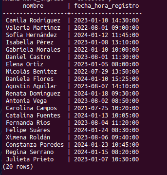

---

## UPDATE

1. Cambiar el estado a inactivo para el estudiante con id 6.
```sql
-- Ver el estado actual del estudiante con id 6
SELECT id, nombre, activo 
FROM estudiantes 
WHERE id = 6;

UPDATE estudiantes 
SET activo = FALSE 
WHERE id = 6;

-- Verificar el cambio
SELECT id, nombre, activo 
FROM estudiantes 
WHERE id = 6;
```
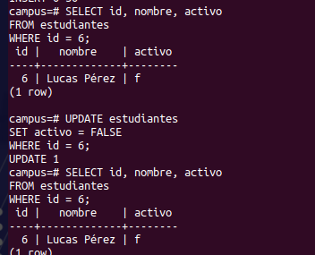

---

2. Incrementar en 0.2 el promedio de todos los estudiantes que tengan un promedio menor a 3.0.
```sql
-- Ver los promedios antes del cambio
SELECT id, nombre, promedio 
FROM estudiantes 
WHERE promedio < 3.0;

UPDATE estudiantes 
SET promedio = promedio + 0.2 
WHERE promedio < 3.0;

-- Verificar los promedios después del cambio
SELECT id, nombre, promedio 
FROM estudiantes 
WHERE promedio < 3.2;
```
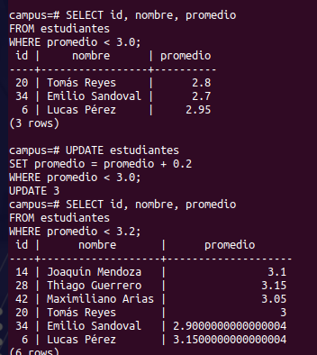

---

3. Actualizar la hora de ingreso a 08:00:00 para todos los estudiantes que ingresaron el día 2024-02-01.
```sql
-- Ver las horas de ingreso antes del cambio
SELECT id, nombre, hora_ingreso 
FROM estudiantes 
WHERE fecha_ingreso = '2024-02-01';

UPDATE estudiantes 
SET hora_ingreso = '08:00:00' 
WHERE fecha_ingreso = '2024-02-01';

-- Verificar el cambio
SELECT id, nombre, hora_ingreso 
FROM estudiantes 
WHERE fecha_ingreso = '2024-02-01';
```
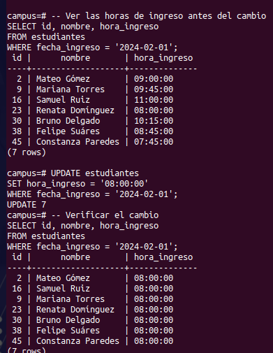

---

4. Modificar el análisis de perfil del estudiante con id 15 para agregar la anotación: "Graduado con honores académicos.".
```sql
-- Ver el perfil antes del cambio
SELECT id, nombre, analisis_perfil 
FROM estudiantes 
WHERE id = 15;

UPDATE estudiantes 
SET analisis_perfil = CONCAT(analisis_perfil, ' Graduado con honores académicos.') 
WHERE id = 15;

-- Verificar el cambio
SELECT id, nombre, analisis_perfil 
FROM estudiantes 
WHERE id = 15;
```
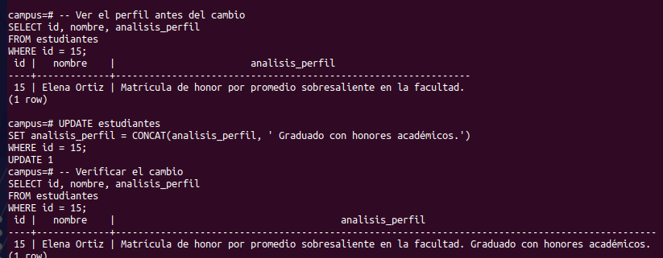

---

5. Cambiar el género a F y actualizar la altura a 1.65 para un estudiante específico cuyo ID sea 20.
```sql
-- Ver los datos antes del cambio
SELECT id, nombre, genero, altura 
FROM estudiantes 
WHERE id = 20;

UPDATE estudiantes 
SET genero = 'F', altura = 1.65 
WHERE id = 20;

-- Verificar el cambio
SELECT id, nombre, genero, altura 
FROM estudiantes 
WHERE id = 20;
```
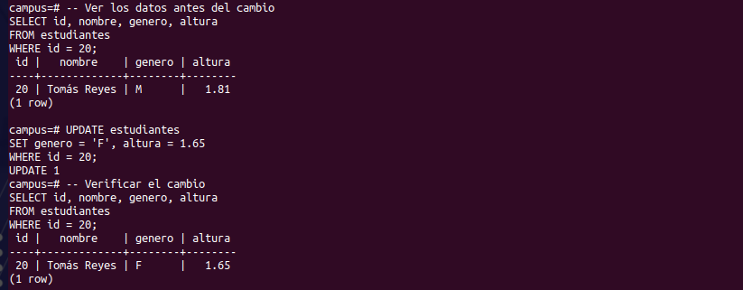

---

6. Desactivar a todos los estudiantes registrados antes del año 2022 que tengan un promedio inferior a 3.5.
```sql
-- Ver los estudiantes que serán desactivados
SELECT id, nombre, fecha_ingreso, promedio, activo 
FROM estudiantes 
WHERE fecha_ingreso < '2022-01-01' AND promedio < 3.5;

UPDATE estudiantes 
SET activo = FALSE 
WHERE fecha_ingreso < '2022-01-01' AND promedio < 3.5;

-- Verificar el cambio
SELECT id, nombre, fecha_ingreso, promedio, activo 
FROM estudiantes 
WHERE fecha_ingreso < '2022-01-01' AND promedio < 3.5;
```
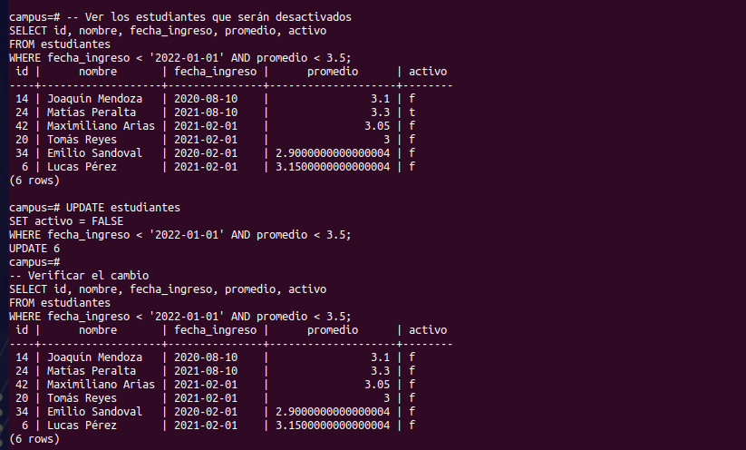

---

7. Ajustar la duración de los tests a 2 horas para todos los estudiantes que actualmente tengan registrada una duración inferior a 1 hora.
```sql
-- Ver las duraciones antes del cambio
SELECT id, nombre, duración_tests 
FROM estudiantes 
WHERE duración_tests < '01:00:00';

UPDATE estudiantes 
SET duración_tests = '02:00:00' 
WHERE duración_tests < '01:00:00';

-- Verificar el cambio
SELECT id, nombre, duración_tests 
FROM estudiantes 
WHERE duración_tests = '02:00:00';
```
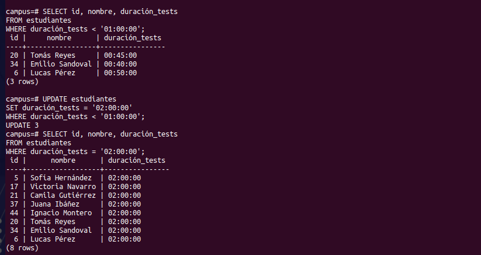

---

8. Aumentar la edad en 1 año a todos los estudiantes que ingresaron en el año 2021.
```sql
-- Ver las edades antes del cambio
SELECT id, nombre, edad 
FROM estudiantes 
WHERE fecha_ingreso BETWEEN '2021-01-01' AND '2021-12-31';

UPDATE estudiantes 
SET edad = edad + 1 
WHERE fecha_ingreso BETWEEN '2021-01-01' AND '2021-12-31';

-- Verificar el cambio
SELECT id, nombre, edad 
FROM estudiantes 
WHERE fecha_ingreso BETWEEN '2021-01-01' AND '2021-12-31';
```
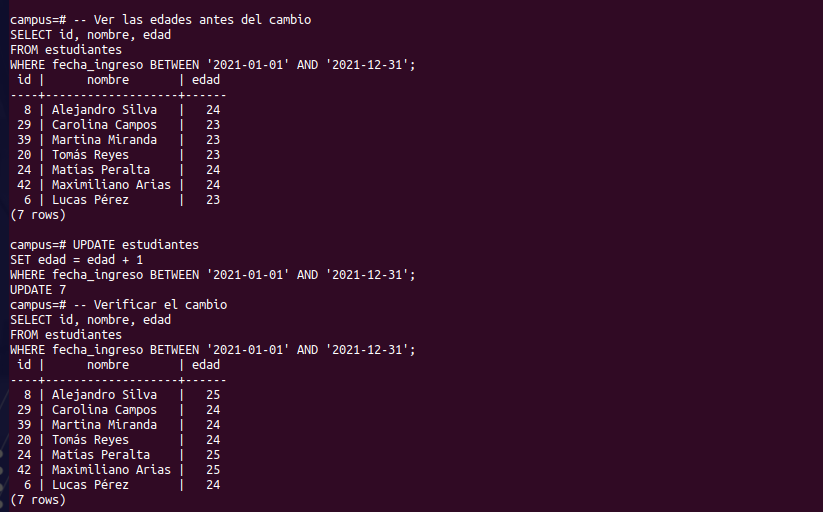

---

9. Limpiar o establecer como NULL el campo analisis_perfil para los estudiantes inactivos.
```sql
-- Ver los perfiles antes del cambio
SELECT id, nombre, analisis_perfil 
FROM estudiantes 
WHERE activo = FALSE;

UPDATE estudiantes 
SET analisis_perfil = NULL 
WHERE activo = FALSE;


```
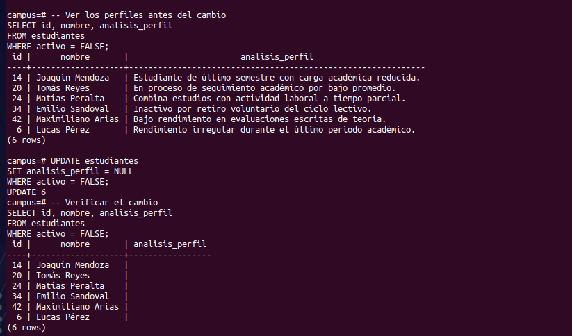

---

10. Actualizar el promedio a 5.0 para el estudiante que tenga la fecha de registro más antigua de la base de datos.
```sql
-- Ver el promedio antes del cambio
SELECT id, nombre, promedio, fecha_hora_registro 
FROM estudiantes 
ORDER BY fecha_hora_registro ASC 
LIMIT 1;

UPDATE estudiantes 
SET promedio = 5.0 
WHERE fecha_hora_registro = (SELECT MIN(fecha_hora_registro) FROM estudiantes);

-- Verificar el cambio
SELECT id, nombre, promedio, fecha_hora_registro 
FROM estudiantes 
ORDER BY fecha_hora_registro ASC 
LIMIT 1;
```
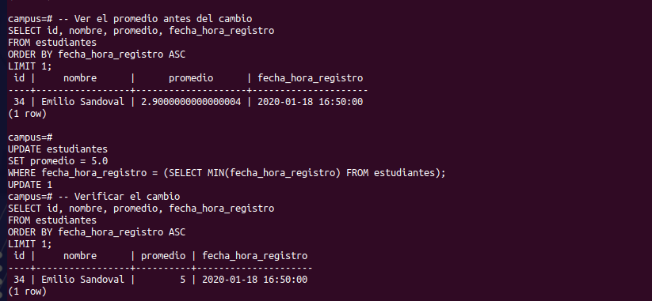

---

## DELETE

1. Eliminar el registro del estudiante con id 34.
```sql
-- Ver el registro antes de eliminarlo
SELECT id, nombre 
FROM estudiantes 
WHERE id = 34;

DELETE FROM estudiantes 
WHERE id = 34;

-- Verificar que se eliminó
SELECT id, nombre 
FROM estudiantes 
WHERE id = 34;
```
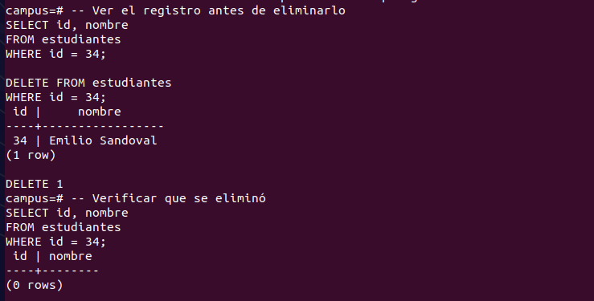

---

2. Borrar todos los estudiantes que estén inactivos.
```sql
-- Ver los estudiantes inactivos que serán eliminados
SELECT id, nombre, activo 
FROM estudiantes 
WHERE activo = FALSE;

DELETE FROM estudiantes 
WHERE activo = FALSE;

-- Verificar que ya no hay inactivos
SELECT id, nombre, activo 
FROM estudiantes 
WHERE activo = FALSE;
```
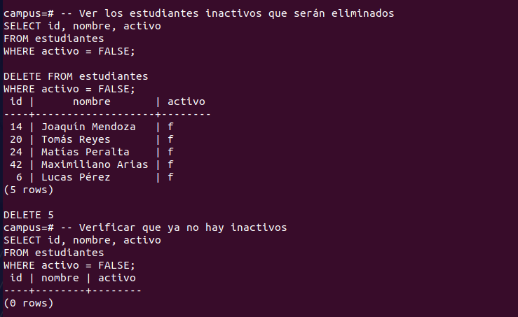

---

3. Eliminar a los estudiantes cuyo promedio sea estrictamente menor a 2.5.
```sql
-- Ver los estudiantes que serán eliminados
SELECT id, nombre, promedio 
FROM estudiantes 
WHERE promedio < 2.5;

DELETE FROM estudiantes 
WHERE promedio < 2.5;

-- Verificar que ya no hay promedios menores a 2.5
SELECT id, nombre, promedio 
FROM estudiantes 
WHERE promedio < 2.5;
```
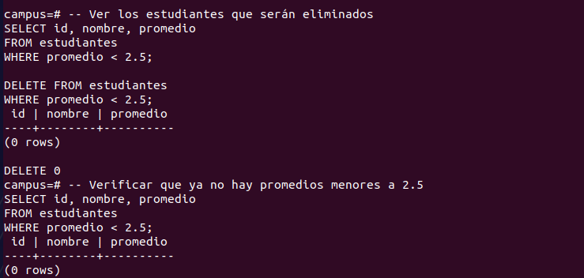

---

4. Borrar las filas de estudiantes cuya fecha de ingreso sea anterior al '2021-01-01'.
```sql
-- Ver los estudiantes que serán eliminados
SELECT id, nombre, fecha_ingreso 
FROM estudiantes 
WHERE fecha_ingreso < '2021-01-01';

DELETE FROM estudiantes 
WHERE fecha_ingreso < '2021-01-01';

-- Verificar que ya no hay ingresos anteriores a 2021
SELECT id, nombre, fecha_ingreso 
FROM estudiantes 
WHERE fecha_ingreso < '2021-01-01';
```
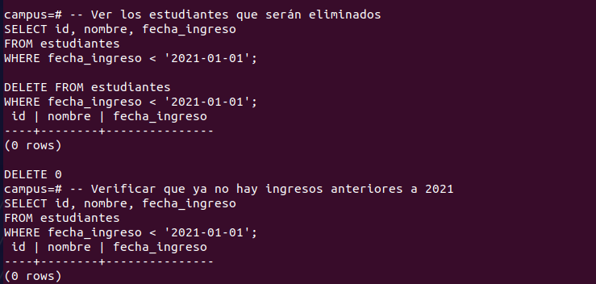

---

5. Eliminar a los estudiantes del género masculino que tengan una altura inferior a 1.60 m.
```sql
-- Ver los estudiantes que serán eliminados
SELECT id, nombre, genero, altura 
FROM estudiantes 
WHERE genero = 'M' AND altura < 1.60;

DELETE FROM estudiantes 
WHERE genero = 'M' AND altura < 1.60;

-- Verificar que ya no hay hombres con altura menor a 1.60
SELECT id, nombre, genero, altura 
FROM estudiantes 
WHERE genero = 'M' AND altura < 1.60;
```
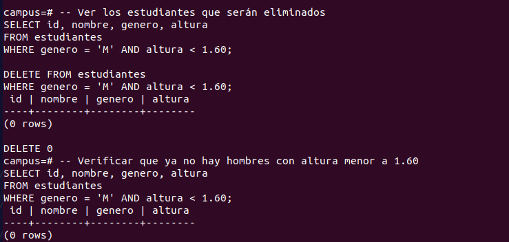

---

6. Borrar los registros de estudiantes ingresados en el año 2024 que se encuentren inactivos.
```sql
-- Ver los estudiantes que serán eliminados
SELECT id, nombre, fecha_ingreso, activo 
FROM estudiantes 
WHERE fecha_ingreso BETWEEN '2024-01-01' AND '2024-12-31' 
AND activo = FALSE;

DELETE FROM estudiantes 
WHERE fecha_ingreso BETWEEN '2024-01-01' AND '2024-12-31' 
AND activo = FALSE;

-- Verificar que ya no hay inactivos del 2024
SELECT id, nombre, fecha_ingreso, activo 
FROM estudiantes 
WHERE fecha_ingreso BETWEEN '2024-01-01' AND '2024-12-31' 
AND activo = FALSE;
```
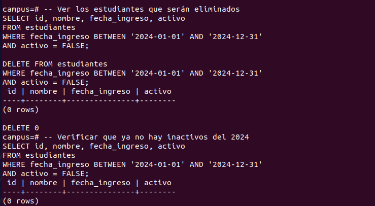

---

7. Eliminar a los estudiantes cuya duración de tests sea menor a 45 minutos.
```sql
-- Ver los estudiantes que serán eliminados
SELECT id, nombre, duración_tests 
FROM estudiantes 
WHERE duración_tests < '00:45:00';

DELETE FROM estudiantes 
WHERE duración_tests < '00:45:00';

-- Verificar que ya no hay duraciones menores a 45 minutos
SELECT id, nombre, duración_tests 
FROM estudiantes 
WHERE duración_tests < '00:45:00';
```
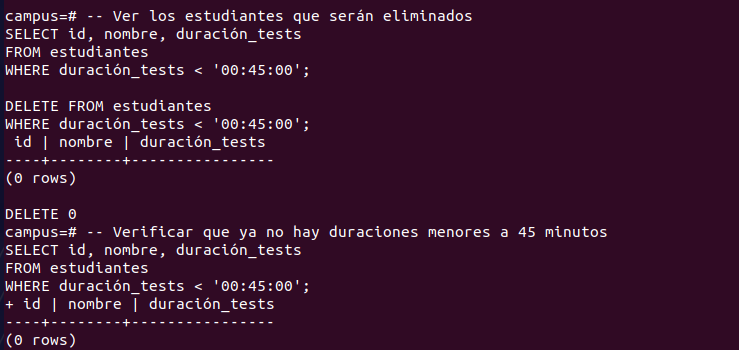

---

8. Borrar a todos los estudiantes cuyo nombre comience con la letra 'E'.
```sql
-- Ver los estudiantes que serán eliminados
SELECT id, nombre 
FROM estudiantes 
WHERE nombre LIKE 'E%';

DELETE FROM estudiantes 
WHERE nombre LIKE 'E%';

-- Verificar que ya no hay nombres con 'E'
SELECT id, nombre 
FROM estudiantes 
WHERE nombre LIKE 'E%';
```
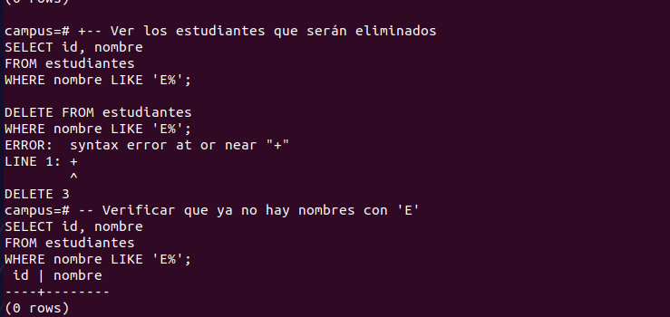

---

9. Eliminar a los estudiantes activos que ingresaron antes del año 2023 y cuyo promedio sea menor a 3.5.
```sql
-- Ver los estudiantes que serán eliminados
SELECT id, nombre, activo, fecha_ingreso, promedio 
FROM estudiantes 
WHERE activo = TRUE 
AND fecha_ingreso < '2023-01-01' 
AND promedio < 3.5;

DELETE FROM estudiantes 
WHERE activo = TRUE 
AND fecha_ingreso < '2023-01-01' 
AND promedio < 3.5;

-- Verificar que ya no hay coincidencias
SELECT id, nombre, activo, fecha_ingreso, promedio 
FROM estudiantes 
WHERE activo = TRUE 
AND fecha_ingreso < '2023-01-01' 
AND promedio < 3.5;
```
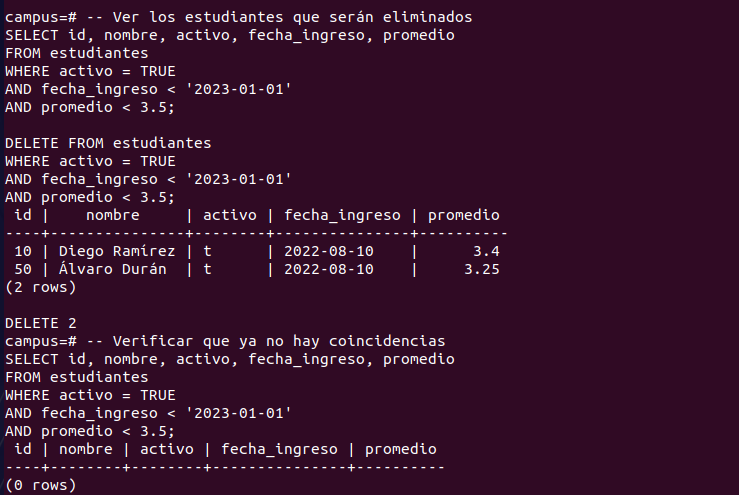

---

10. Vaciar completamente la tabla estudiantes eliminando todos sus registros.
```sql
-- Ver cuántos registros hay antes de vaciar
SELECT COUNT(*) AS total_registros 
FROM estudiantes;

DELETE FROM estudiantes;

-- Verificar que la tabla quedó vacía
SELECT COUNT(*) AS total_registros 
FROM estudiantes;
```
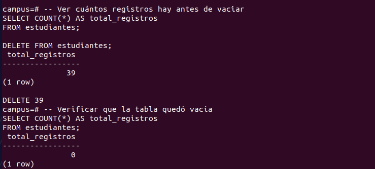
