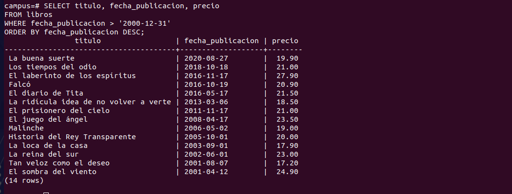
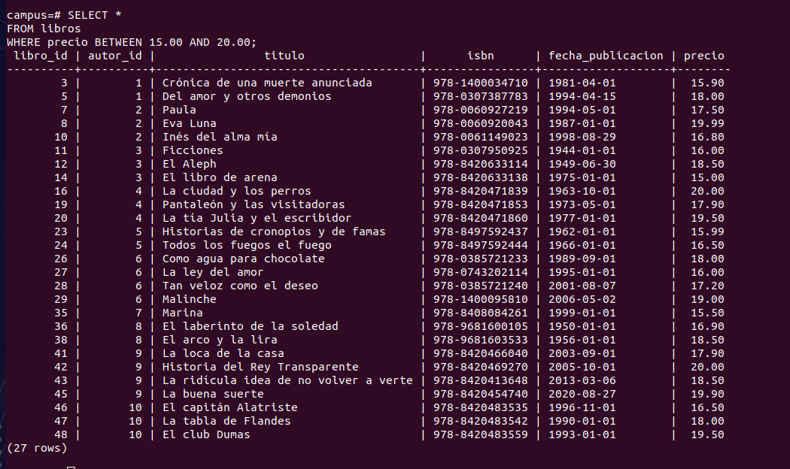
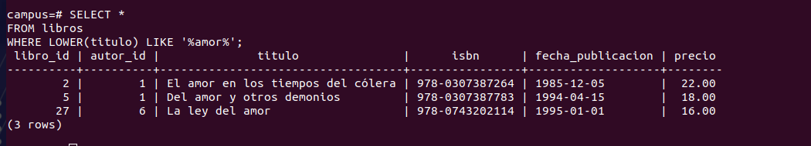
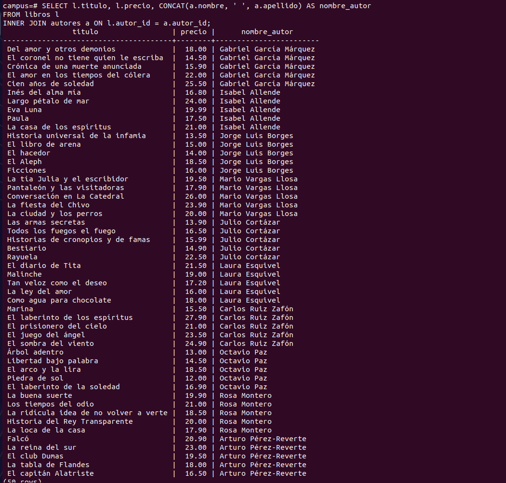
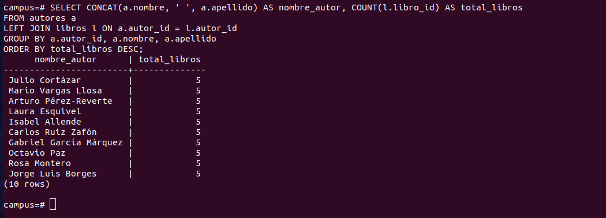
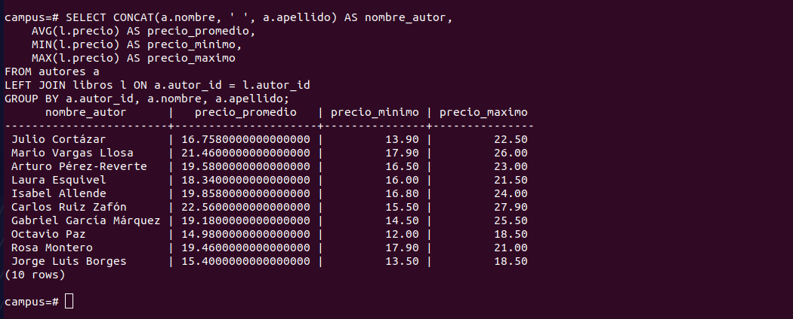
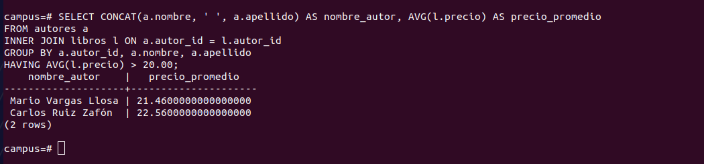
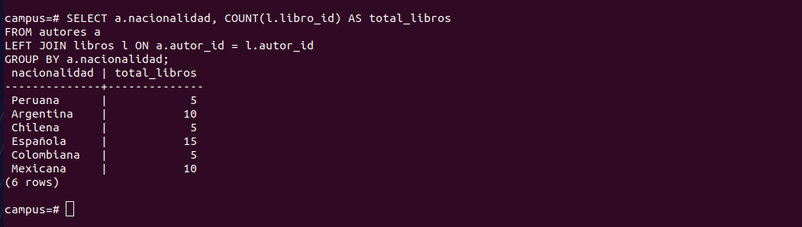

# Resultados del Review 2

Para este review se utilizó una base de datos con las tablas `autores` y `libros`, relacionadas mediante una llave foránea.

```sql
CREATE TABLE autores (
    id SERIAL PRIMARY KEY,
    nombre VARCHAR(60),
    apellido VARCHAR(60),
    nacionalidad VARCHAR(60)
);

CREATE TABLE libros (
    id SERIAL PRIMARY KEY,
    titulo VARCHAR(120),
    fecha_publicacion DATE,
    precio NUMERIC(10,2),
    autor_id INT REFERENCES autores(id)
);
```

## Consultas

1. Obtener el título, fecha de publicación y precio de todos los libros publicados después del año 2000, ordenados del más reciente al más antiguo.
```sql
SELECT titulo, fecha_publicacion, precio 
FROM libros 
WHERE fecha_publicacion > '2000-12-31' 
ORDER BY fecha_publicacion DESC;
```


---

2. Listar los nombres completos (nombre y apellido en una sola columna) y la nacionalidad de todos los autores cuya nacionalidad sea 'Española' o 'Argentina'.
```sql
SELECT CONCAT(nombre, ' ', apellido) AS nombre_completo, nacionalidad 
FROM autores 
WHERE nacionalidad IN ('Española', 'Argentina');
```


---

3. Consultar todos los libros cuyo precio esté entre $15.00 y $20.00 inclusive.
```sql
SELECT * 
FROM libros 
WHERE precio BETWEEN 15.00 AND 20.00;
```


---

4. Buscar todos los libros cuyo título contenga la palabra "amor" (sin importar si está en mayúsculas o minúsculas).
```sql
SELECT * 
FROM libros 
WHERE LOWER(titulo) LIKE '%amor%';
```


---

5. Mostrar los 5 libros más costosos de la base de datos con su título y precio.
```sql
SELECT titulo, precio 
FROM libros 
ORDER BY precio DESC 
LIMIT 5;
```


---

6. Mostrar el título del libro, el precio y el nombre completo del autor al que pertenece cada libro.
```sql
SELECT l.titulo, l.precio, CONCAT(a.nombre, ' ', a.apellido) AS nombre_autor 
FROM libros l 
INNER JOIN autores a ON l.autor_id = a.id;
```


---

7. Calcular la cantidad total de libros que ha escrito cada autor. Mostrar el nombre completo del autor y el total de libros, ordenados de mayor a menor.
```sql
SELECT CONCAT(a.nombre, ' ', a.apellido) AS nombre_autor, COUNT(l.id) AS total_libros 
FROM autores a 
LEFT JOIN libros l ON a.id = l.autor_id 
GROUP BY a.id, a.nombre, a.apellido 
ORDER BY total_libros DESC;
```


---

8. Obtener el precio promedio, el precio mínimo y el precio máximo de los libros publicados por cada autor.
```sql
SELECT CONCAT(a.nombre, ' ', a.apellido) AS nombre_autor, 
    AVG(l.precio) AS precio_promedio, 
    MIN(l.precio) AS precio_minimo, 
    MAX(l.precio) AS precio_maximo 
FROM autores a 
LEFT JOIN libros l ON a.id = l.autor_id 
GROUP BY a.id, a.nombre, a.apellido;
```


---

9. Listar los autores que tienen un promedio de precio en sus libros superior a $20.00.
```sql
SELECT CONCAT(a.nombre, ' ', a.apellido) AS nombre_autor, AVG(l.precio) AS precio_promedio 
FROM autores a 
INNER JOIN libros l ON a.id = l.autor_id 
GROUP BY a.id, a.nombre, a.apellido 
HAVING AVG(l.precio) > 20.00;
```


---

10. Contar cuántos libros se han publicado por cada nacionalidad de los autores.
```sql
SELECT a.nacionalidad, COUNT(l.id) AS total_libros 
FROM autores a 
LEFT JOIN libros l ON a.id = l.autor_id 
GROUP BY a.nacionalidad;
```
