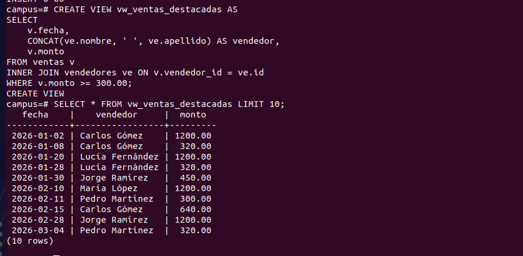
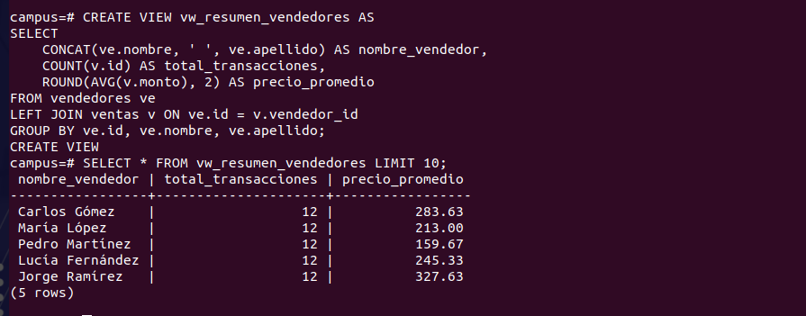
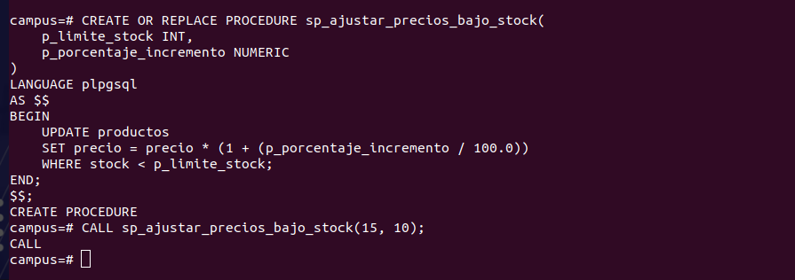
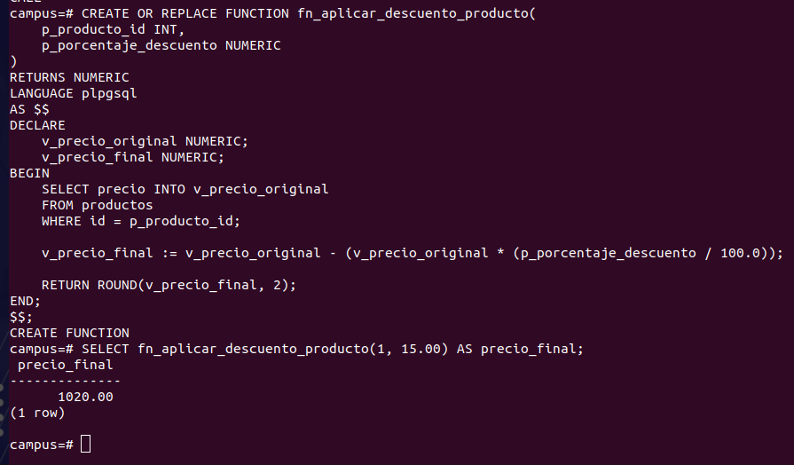

# Resultados del Review 3

Para este review se utilizó una base de datos con las tablas `vendedores`, `productos` y `ventas`, relacionadas mediante llaves foráneas.

```sql
CREATE TABLE vendedores (
    id SERIAL PRIMARY KEY,
    nombre VARCHAR(60),
    apellido VARCHAR(60)
);

CREATE TABLE productos (
    id SERIAL PRIMARY KEY,
    nombre VARCHAR(100),
    precio NUMERIC(10,2),
    stock INT
);

CREATE TABLE ventas (
    id SERIAL PRIMARY KEY,
    fecha DATE,
    monto NUMERIC(10,2),
    vendedor_id INT REFERENCES vendedores(id),
    producto_id INT REFERENCES productos(id)
);
```

## 1. Vista vw_ventas_destacadas

Crear una vista llamada vw_ventas_destacadas que contenga únicamente los registros de ventas cuyo monto sea igual o superior a $300.00, incluyendo la fecha, el vendedor y el monto.
```sql
CREATE VIEW vw_ventas_destacadas AS
SELECT 
    v.fecha,
    CONCAT(ve.nombre, ' ', ve.apellido) AS vendedor,
    v.monto
FROM ventas v
INNER JOIN vendedores ve ON v.vendedor_id = ve.id
WHERE v.monto >= 300.00;
```


---

## 2. Vista vw_resumen_vendedores

Crear una vista llamada vw_resumen_vendedores que muestre el nombre de cada vendedor, el número total de transacciones realizadas y el precio promedio de sus ventas redondeado a dos decimales.
```sql
CREATE VIEW vw_resumen_vendedores AS
SELECT 
    CONCAT(ve.nombre, ' ', ve.apellido) AS nombre_vendedor,
    COUNT(v.id) AS total_transacciones,
    ROUND(AVG(v.monto), 2) AS precio_promedio
FROM vendedores ve
LEFT JOIN ventas v ON ve.id = v.vendedor_id
GROUP BY ve.id, ve.nombre, ve.apellido;
```


---

## 3. Procedimiento sp_ajustar_precios_bajo_stock

Crear un procedimiento llamado sp_ajustar_precios_bajo_stock que aplique un incremento porcentual al precio de todos los productos cuyo stock sea menor a cierto límite recibido por parámetro (por ejemplo, aumentar un 10% el precio a productos con menos de 15 unidades en existencia).
```sql
CREATE OR REPLACE PROCEDURE sp_ajustar_precios_bajo_stock(
    p_limite_stock INT,
    p_porcentaje_incremento NUMERIC
)
LANGUAGE plpgsql
AS $$
BEGIN
    UPDATE productos
    SET precio = precio * (1 + (p_porcentaje_incremento / 100.0))
    WHERE stock < p_limite_stock;
END;
$$;

-- Ejemplo de uso: aumentar un 10% el precio a productos con menos de 15 unidades
CALL sp_ajustar_precios_bajo_stock(15, 10);
```


---

## 4. Función fn_aplicar_descuento_producto

Crear una función llamada fn_aplicar_descuento_producto que reciba el id del producto y un porcentaje de descuento (por ejemplo, 15.00 para 15%). La función debe calcular el precio final restando el descuento al precio original.
```sql
CREATE OR REPLACE FUNCTION fn_aplicar_descuento_producto(
    p_producto_id INT,
    p_porcentaje_descuento NUMERIC
)
RETURNS NUMERIC
LANGUAGE plpgsql
AS $$
DECLARE
    v_precio_original NUMERIC;
    v_precio_final NUMERIC;
BEGIN
    SELECT precio INTO v_precio_original
    FROM productos
    WHERE id = p_producto_id;

    v_precio_final := v_precio_original - (v_precio_original * (p_porcentaje_descuento / 100.0));

    RETURN ROUND(v_precio_final, 2);
END;
$$;

-- Ejemplo de uso: aplicar un 15% de descuento al producto con id 1
SELECT fn_aplicar_descuento_producto(1, 15.00) AS precio_final;
```
